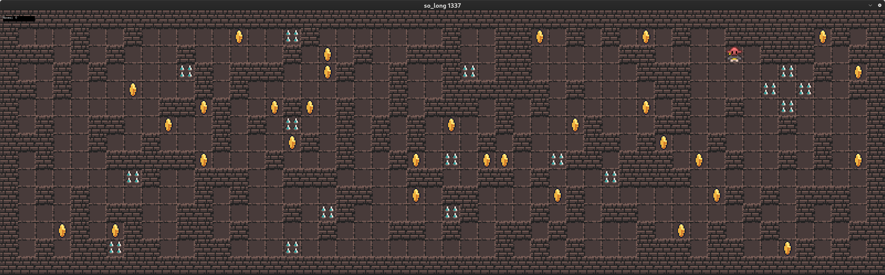

# 🕹️ so_long

## 📸 Game Screenshot



Here is a preview of the **so_long** game. Navigate through the map, collect items, and avoid obstacles to win!

Welcome to **so_long**, a 2D game project from **1337 School** where you explore a small map, collect items, and reach the exit while mastering C programming and the **MiniLibX** graphical library. This project also includes a **Bonus** version for additional challenges and features. 🚀

---

## 📜 Table of Contents

1. [Introduction](#-introduction)
2. [Features](#-features)
3. [Bonus Features](#-bonus-features)
4. [Installation](#-installation)
5. [How to Play](#-how-to-play)
6. [Game Controls](#-game-controls)
7. [Project Structure](#-project-structure)
8. [Resources](#-resources)
9. [License](#-license)

---

## 🌟 Introduction

The **so_long** project is a simple yet exciting 2D game written in C using **MiniLibX**. The player navigates through a map to collect items, avoid obstacles, and reach the exit. It’s a great way to learn about:

- 2D game mechanics 🕹️
- Graphics programming 💻
- Event handling ⌨️

---

## ✨ Features

- **Player Movement**: Smooth movement across the game map.
- **Collectibles**: Gather all items before heading to the exit.
- **Map Validation**: Supports `.ber` map files with validation for correct formats.
- **Dynamic Graphics**: Real-time rendering with **MiniLibX**.

---

## 🚀 Bonus Features

The **Bonus** version includes:

- **Enemy Movement**: Avoid dynamic enemies while collecting items.
- **Animations**: Smooth animations for the player, enemies, and collectibles.
- **Score Counter**: Displays the total moves and collectibles count in real time.
- **Additional Maps**: Play with more complex maps for added fun.

---

## 🛠 Installation

### Prerequisites

Before starting, ensure the following are installed:

- **MiniLibX**: Install it using your package manager or manually from [MiniLibX](https://harm-smits.github.io/42docs/libs/minilibx).
- **gcc**: A C compiler like `gcc`.
- **make**: A build tool for compiling the project.

### Clone the Repository

Clone this repository to your local machine:
```bash
git clone git@github.com:ahaded777/so_long-42.git
cd so_long-42

## 🛠️ Compile the Game

Run the following command to compile the game:

```bash
make
```

For the Bonus version:

```bash
make bonus
```

## 🎮 How to Play

Run the game by specifying a valid `.ber` map file:

```bash
./so_long maps/level1.ber
```

For the Bonus version:

```bash
./so_long_bonus maps/level1.ber
```

### Example:

```bash
./so_long maps/example.ber
```

## 🗺️ Map Files

Map files are stored in the `maps/` directory. Each map should follow the `.ber` format with a valid structure:

- **Walls (1)**
- **Free space (0)**
- **Player start (P)**
- **Collectibles (C)**
- **Exit (E)**

## 🎮 Game Controls

Use the following keys to control your player:

- **W**: Move up
- **A**: Move left
- **S**: Move down
- **D**: Move right
- **ESC**: Quit the game

## 📁 Project Structure

```bash
so_long/
├── src/                # Source files
├── includes/           # Header files
├── maps/               # Map files (.ber)
├── assets/             # Game assets (sprites)
├── bonus/              # Bonus version source files
├── Makefile            # Build system
└── README.md           # Project documentation
```

## 📚 Resources

- [42 School's so_long Subject](https://example.com)
- [MiniLibX Documentation](https://harm-smits.github.io/42docs/libs/minilibx)
- [C Programming Tutorials](https://www.learn-c.org/)
- [Game Development Tutorials](https://www.gamedev.net/)

Enjoy the game and have fun coding!


